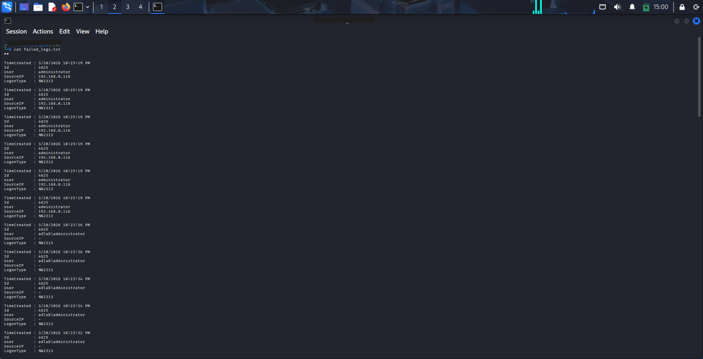
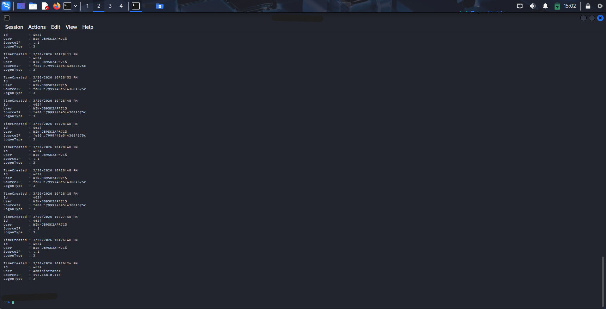

# Brute Force Attack Detection & Investigation (Windows Event Logs)

## Objective

To simulate a brute force attack in a lab environment and investigate it using Windows Security Event Logs.

## Lab Setup

* **Attacker Machine:** Kali Linux
* **Target Machine:** Windows Server 2022
* **Protocol Used:** SMB
* **Tools Used:** CrackMapExec, PowerShell

## Attack Simulation

1. Enabled auditing using `auditpol`
2. Attempted brute force attack from Kali Linux
3. Successfully obtained credentials using SMB
4. Executed commands (`whoami`, `qwinsta`) after login

## Attack Scenario

An attacker from Kali Linux attempted multiple login attempts against a Windows Server 2022 machine using SMB authentication.
After multiple failed attempts (Event ID 4625), a successful login (Event ID 4624) was observed.
Post-authentication, the attacker executed commands such as `whoami` and `qwinsta`, indicating system access.

## Detection Logic

- Multiple failed logins from same IP → Event ID 4625
- Followed by successful login → Event ID 4624
- Followed by process execution → Event ID 4688

This pattern indicates a brute force attack leading to compromise.

## 🔍 Detection Phase

### Failed Login Attempts (Event ID: 4625)

* Multiple failed login attempts detected
* Target user: `administrator`
* Source IP: `192.168.0.116`

Screenshot:

### Successful Login (Event ID: 4624)

* Successful login from same source IP
* Confirms brute force success

Screenshot:

## Investigation Phase

### Process Execution (Event ID: 4688)

Observed attacker activity:

* `cmd.exe` → Command execution
* `whoami.exe` → Privilege verification
* `qwinsta.exe` → Session enumeration

Screenshot:

## Real-World Relevance

This type of attack is common in enterprise environments where attackers attempt password spraying or brute force attacks on exposed services such as SMB or RDP.
SOC analysts use log correlation techniques like this to detect early-stage compromise.

## Key Findings

* Detected brute force attack using Windows logs
* Correlated failed and successful login events
* Identified attacker IP address
* Observed post-compromise command execution
* Confirmed attacker interaction with system

## Conclusion

The system was successfully compromised via brute force attack.
Post-compromise activity indicates attacker reconnaissance using command-line tools.

## Skills Demonstrated

* Windows Event Log Analysis
* Incident Investigation
* Log Correlation
* PowerShell for Security Analysis
* Basic Threat Detection

---

## Future Improvements

* Integrate logs into SIEM (Splunk)
* Automate brute force detection alerts
